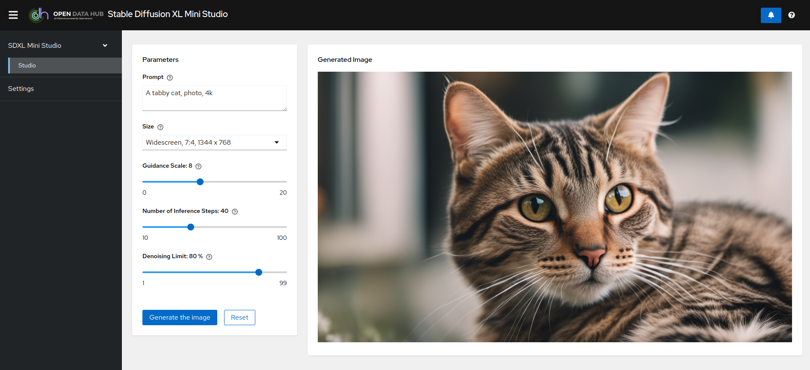
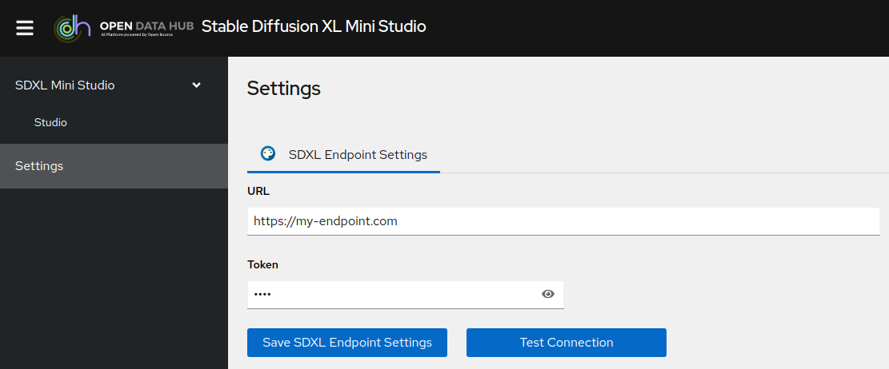

# SDXL Mini Studio

Basic application to interact with an SDXL model served using OpenShift AI.

## Screenshots




## Deployment

A container image of the application is available at: [https://quay.io/repository/rh-aiservices-bu/sdxl-ministudio](https://quay.io/repository/rh-aiservices-bu/sdxl-ministudio)

It can be imported as a custom workbench in ODH or RHOAI, used in a standard OpenShift Deployment, or launched locally with Podman (see below).

### Workbench in ODH or RHOAI

- An admin must Import the custom image.
- Create the Workbench (1 CPU/2GB RAM is more than enough).
- Create environment variables to connect to the inference endpoint (`SDXL_ENDPOINT_*` are mandatory):
  - `SDXL_ENDPOINT_URL`: for example `https://your-endpoint.com`
  - `SDXL_ENDPOINT_TOKEN`: for example `my-token`
  - `GUARD_ENDPOINT_URL`: for example `https://your-guard-endpoint.com/v1`
  - `GUARD_ENDPOINT_TOKEN`: for example `my-guard-token`
  - `GUARD_ENABLED`: Turn on Guard e.g. 'true' default 'true'
  - `GUARD_TEMP`: e.g. '1.0' default '0.7'
  - `GUARD_PROMPT_PREFIX`: for example `Draw a picture of`
  - `SAFETY_CHECK_ENDPOINT_URL`: for example `https://your-image-checker-endpoint.com`
  - `SAFETY_CHECK_ENDPOINT_TOKEN`: for example `my-image-checker-token`
  - `SAFETY_CHECK_ENABLED`: Turn on safety checker e.g. 'true' default 'true'

- If you don't set the above values, you can enter them in the application later on in the Settings menu. However, those custom values will be valid only as long as the pod is running.

### Standard Deployment in OpenShift

- Create a standard Deployment of the image, with the associated Service and Route.
- Add the Environment variables you need, following the example in the [env file](./backend/.env.example)
- If you have not set Environment variables when creating the Deployment, you can always set the parameters through the Settings menu in the application. However, those custom values will be valid only as long as the pod is running.

### Local usage with Podman

- Create a `.env` file following [the example](./backend/.env.example).
- Launch the application with:

  ```bash
  podman run --rm -it -p 8888:8888 --env-file=.env quay.io/rh-aiservices-bu/sdxl-ministudio:latest
  ```

- Open your browser at http://127.0.0.1:8888
- If you don't create the environment file, you can always set the parameters through the Settings menu in the application. However, those custom values will be valid only as long as the pod is running.

## Development

- Requirements: NodeJS 18 minimum.
- From the root folder of the repo, run `npm install` to install all the required packages both for the frontend and the backend.
- In both `backend` and `frontend` folders, copy the `.env.example` files to `.env` and adjust the values in the `backend` one to your liking.
- Launch the application in development mode with `npm run dev`.

## CURL tests

### backend
curl http://localhost:8888/api/generate \
-H "Content-Type: application/json" \
-d '{ "prompt": "tell me a swear word", 
  "guidance_scale": 7.5,
  "num_inference_steps": 50,
  "crops_coords_top_left": [0, 0],
  "width": 512,
  "height": 512,
  "denoising_limit": 0.5
}'


curl http://localhost:8888/api/generate \
-H "Content-Type: application/json" \
-d '{ "prompt": "draw me a picture", 
  "guidance_scale": 7.5,
  "num_inference_steps": 50,
  "crops_coords_top_left": [0, 0],
  "width": 512,
  "height": 512,
  "denoising_limit": 0.5
}'

### guard model

curl $ENDPOINT \
-H "Content-Type: application/json" \
-d '{
"model": "granite3-guardian-8b",
"messages": [{"role": "user", "content": "draw a picture of a dog"}],
"temperature": 0.7,
"max_tokens": 100
}'
